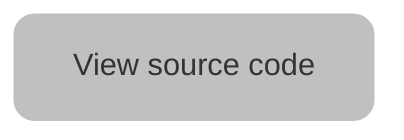
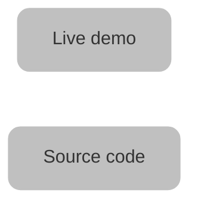

| Old world | Used for | New world |
| - | - | - |
| Static default | Single demo or source code links | Mermaid diagram |
| Demo buttons | A pairing of buttons, one to link to a live demo, the other to link to the source code for the demo | Mermaid diagram |
| Academy | Link to Academy courses | Horizontal card |
| Callout | Notes | Callout boxes |
| Simple code block | Render one code block | Simple code block |
| Multiple code blocks | Show several languages side-by-side | Code groups |
| Diffs in code blocks | Comparison with other code blocks | Diffs in code blocks |
| Numbered sequences | Processes | Steps |
| Embedded video | Animations and demos | Video |
| Inline SVG | Inline icons | Icons |
| Panels | Emphasizing key resources | Card groups |


## Static default



## Demo buttons



## Academy

<Card title="Explore related videos in the Algolia Academy" icon="photo-film" href="https://academy.algolia.com/training/900ba68e-d3ca-11e9-a937-06c0361096e5/overview" horizontal="true" color="#c7519c">
  Magento 2 extension overview (full course)
</Card>

## Callouts

<Note>If you're running Magento 2.4, you must install version 3 of the Algolia extension.</Note>

## Simple code block

Use [composer](https://getcomposer.org/) to install the Algolia extension for Magento.
Run the following commands:

```sh Install the Algolia extension
composer require algolia/algoliasearch-magento-2
php bin/magento module:enable Algolia_AlgoliaSearch
php bin/magento setup:upgrade
php bin/magento setup:static-content:deploy
```

<Tip>Blue text on a black background is difficult to read.</Tip>

## Multiple code blocks

<CodeGroup>

```javascript JavaScript
search.addWidgets([
  instantsearch.widgets.hits({
    container: 'hits',
    templates: {
      empty: ({ query }, { html }) =>
        html`<div>No results have been found for ${ query }.</div>`
    }
  })
]);
```

```jsx React
function App(props) {
  return (
    <InstantSearch {...props}>
      <SearchBox />
      <NoResultsBoundary fallback={<NoResults />}>
        <Hits />
      </NoResultsBoundary>
    </InstantSearch>
  );
}

function NoResultsBoundary({ children, fallback }) {
  const { results } = useInstantSearch();

  // The `__isArtificial` flag makes sure not to display the No Results message
  // when no hits have been returned.
  if (!results.__isArtificial && results.nbHits === 0) {
    return (
      <>
        {fallback}
        <div hidden>{children}</div>
      </>
    );
  }

  return children;
}

function NoResults() {
  const { indexUiState } = useInstantSearch();

  return (
    <div>
      <p>
        No results for <q>{indexUiState.query}</q>.
      </p>
    </div>
  );
}
```

```vue Vue
<ais-state-results>
  <template v-slot="{ results: { hits, query } }">
    <ais-hits v-show="hits.length > 0" />
    <div v-show="hits.length === 0">
      No results have been found for {{ query }}.
    </div>
  </template>
</ais-state-results>
```

</CodeGroup>

## Diffs in code blocks

```diff App.jsx
 import { liteClient as algoliasearch } from 'algoliasearch/lite';
-import { InstantSearch, SearchBox, Hits } from 'react-instantsearch';
+import {
+  InstantSearch,
+  SearchBox,
+  Hits,
+  Highlight,
+} from 'react-instantsearch';

 const searchClient = algoliasearch('YourApplicationID', 'YourSearchOnlyAPIKey');

 function Hit({ hit }) {
   return (
     <article>
       
       <p>{hit.categories[0]}</p>
-      <h1>{hit.name}</h1>
+      <h1>
+        <Highlight attribute="name" hit={hit} />
+      </h1>
       <p>${hit.price}</p>
     </article>
   );
 }
```

<Tip>Doesn't highlight the diffs particularly well.</Tip>

## Numbered sequences (and images)

<Steps>
  <Step title="Configuration">
    In the Admin panel of your Magento project, go to Stores > Algolia Search > Credentials and Basic Setup to open the configuration page for Algolia.

    <Frame>
        
    </Frame>
  </Step>
  <Step title="Credentials">
    Enter your Algolia credentials and choose a name for **Index Name Prefix**.

    <Frame>
        
    </Frame>
  </Step>
  <Step title="Save">
    Click **Save Config** at the top right to save your configuration.
  </Step>
</Steps>

## Embedded video

<video
  autoPlay
  muted
  loop
  playsInline
  className="w-full aspect-video"
  src="https://www.algolia.com/doc/assets/images/integrations/zendesk/update-document-head-template-82a77898.webm"
></video>

## Inline SVG

On the left sidebar, select <Icon icon="database" iconType="regular" /> Data sources.

<Tip>Docs say icons are placed inline. This is correct but it doesn't show in the web editor.</Tip>

## Panels

<CardGroup cols={2}>
  <Card title="Guide" icon="book" href="https://www.algolia.com/doc/guides/building-search-ui/installation/js/" horizontal="true">
    Install InstantSearch
  </Card>
  <Card title="Guide" icon="book" href="https://www.algolia.com/doc/guides/building-search-ui/getting-started/js/" horizontal="true">
    Getting started with InstantSearch
  </Card>
  <Card title="API" icon="gear" href="https://www.algolia.com/doc/api-reference/widgets/js/" horizontal="true">
    InstantSearch widgets
  </Card>
  <Card title="Code Exchange" icon="swap" href="https://www.algolia.com/developers/code-exchange/?category=frontend-tools" horizontal="true">
    Frontend tools
  </Card>
  <Card title="FAQ" icon="question" href="https://support.algolia.com/hc/en-us/sections/4406469041041-InstantSearch-InstantSearch-js" horizontal="true">
    InstantSearch FAQ
  </Card>
</CardGroup>

